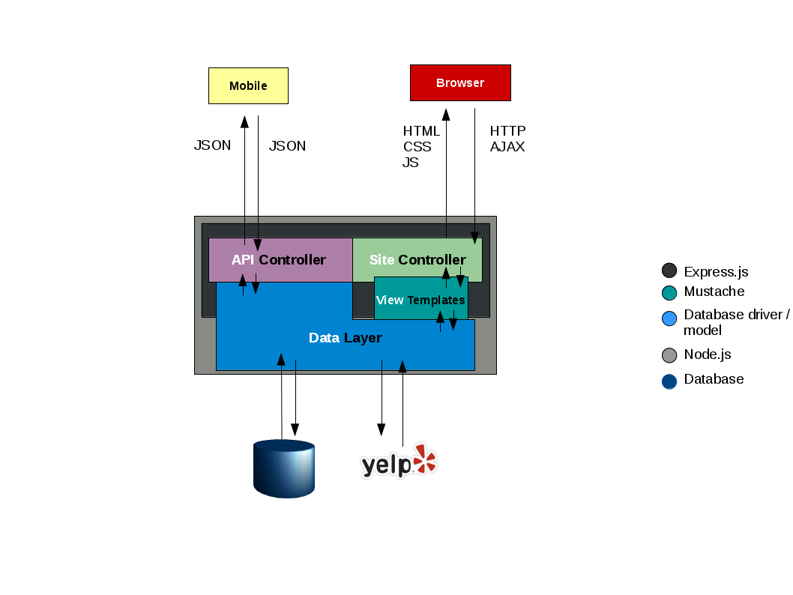

What2Eat
========

##How to run?

1. Install *Node.js 4.3.2 LTS*.
2. Clone this repository
3. Create a filenamed  ```oauth.sh``` with the following contents:
   ```
   #!/bin/bash

   export CONSUMER_KEY='xxxxxxxxx'

   export CONSUMER_SECRET='xxxxxxxxxx'

   export TOKEN='xxxxxxxx'

   export TOKEN_SECRET='xxxxxxxx'

   export PORT=9000
   ```
4. Open a terminal a run ```source oauth.sh```
5. Install backend dependencies. In the terminal run ```npm install```
6. Install client side dependency manager globally ```npm install -g bower```
7. Install frontend dependencies. In the terminal run ```bower install```
8. Run server. In the terminal run ```node backend/server.js```
9. See web app. In your browser, navigate to [http://localhost:9000](http://localhost:9000/)
10. [**Optional**] Feel like maximizing perfomance? Run ```node backend/cluster.js``` instead of step 8.

##Testing

* Run ```mocha -R spec test/route-test.js```

##What should I know?

* [JavaScript](https://developer.mozilla.org/en-US/docs/Web/JavaScript)
* [Strict Mode](https://developer.mozilla.org/en-US/docs/Web/JavaScript/Reference/Strict_mode)
* [ECMAScript 6](http://es6-features.org/#Constants)
* [AngularJS](https://angularjs.org)
* [Node.js](https://nodejs.org/en/)
* [Express.js](https://github.com/j-diaz/what2eat.git)
* [Boostrap CSS](http://getbootstrap.com/css/)
* [Mocha](http://mochajs.org/) testing framework
* General knowledge of how the web works (HTTP, HTTP2, WebSockets, HTML, CSS, etc.).

##System Architecture

Block diagram of system component architecture

